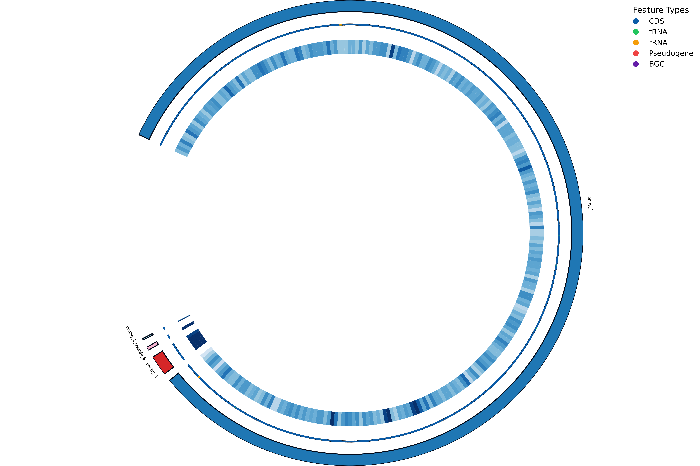
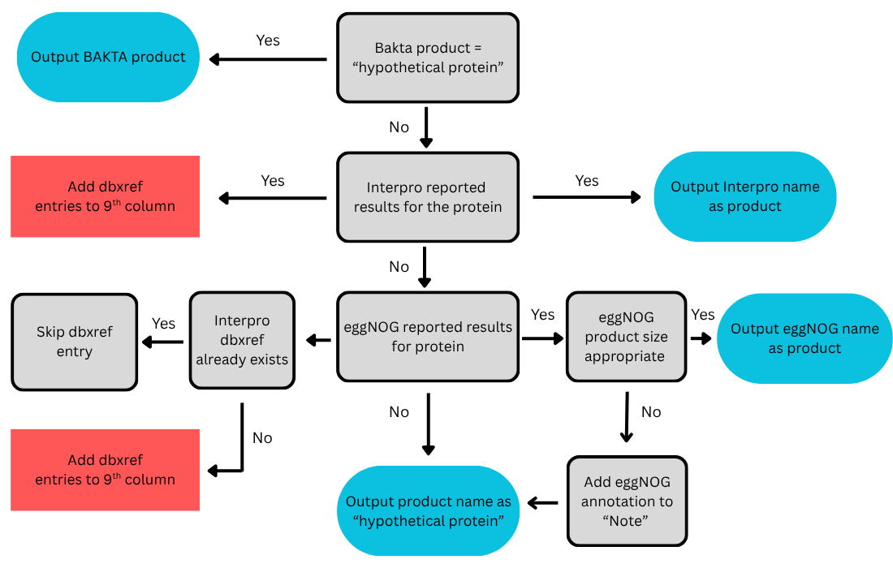

# ReAnnota


## Introduction

**ReAnnota** is a Python pipeline initially developed for enhancing cyanobacteria genome annotations by merging results from multiple annotation tools (Bakta, EggNOG, InterPro, antiSMASH, Pseudogenefinder) into a final Gff file.

## Usage

### Setup

To run `ReAnnota` ,the required dependencies must first be downloaded. We reccomend using `uv`:

```bash
uv .venv
source .venv/bin/activate
uv pip install e.
```
### Input files

| **Tool / Input** | **File Description** |
|------------------|----------------------|
| **Bakta** | GBFF file (`.gbff`) generated by annotation tool *(required)* |
| **Output** | Output GBFF file path *(required)* |
| **EggNOG** | Annotation file in TSV format (`.tsv`) |
| **InterProScan** | Annotation file in GFF3 format (`.gff3`) |
| **antiSMASH** | regions file in JSON format (`.json`) |
| **Pseudofinder** | Pseudofinder file in GFF format (`.gff`) |
| **Gecco** | csv containing all Gecco produced cluster files in GenBank format (`.gbk`) |
| **GFF comparison** | Gff file (`.gff`) produced by annotation tool |


### Running ReAnnota

Running `ReAnnota` with the `--help` option will display th help message:

```angular2html
 Cyanobacteria genome annotation enhancement pipeline                           
                                                                                
╭─ Options ────────────────────────────────────────────────────────────────────╮
│ --version  -v        Print the current tool version and exit.                │
│ --help     -h        Show this message and exit.                             │
╰──────────────────────────────────────────────────────────────────────────────╯
╭─ Commands ───────────────────────────────────────────────────────────────────╮
│ annotate   Run the genome annotation enhancement pipeline.                   │
╰──────────────────────────────────────────────────────────────────────────────╯
```
Running the command `annotate` with the `--help` option will display th help message:

```angular2html
╭─ Options ────────────────────────────────────────────────────────────────────╮
│ *  --gbff-input         -gbi      FILE                  Input GBFF file      │
│                                                         generated by Bakta.  │
│                                                         [required]           │
│ *  --output             -o        FILE                  Output GBFF file     │
│                                                         path.                │
│                                                         [required]           │
│    --egg-input          -ei       FILE                  Input EggNOG         │
│                                                         annotation file      │
│                                                         (.tsv).              │
│    --ipr-input          -ii       FILE                  Input InterPro       │
│                                                         annotation file      │
│                                                         (.gff3).             │
│    --antismash-input    -ai       FILE                  Input antiSMASH      │
│                                                         annotation file      │
│                                                         (.json).             │
│    --pseudofinder-inp…  -pi       FILE                  Input Pseudofinder   │
│                                                         annotation file      │
│                                                         (.gff).              │
│    --gecco-input        -pi       FILE                  Input Gecco          │
│                                                         annotation file      │
│                                                         (.gbk).              │
│    --gff-input          -gfi      FILE                  Input GFF file for   │
│                                                         comparison.          │
│    --log-file           -l        FILE                  Optional log file    │
│                                                         path. If not         │
│                                                         provided, will be    │
│                                                         created in output    │
│                                                         directory.           │
│    --log-level                    [debug|info|warning|  Set the desired log  │
│                                   error|critical]       level.               │
│                                                         [default: INFO]      │
│    --circos                                             Generate Circos      │
│                                                         visualization.       │
│    --compare                                            Generate gff         │
│                                                         comparison file      │
│    --help               -h                              Show this message    │
│                                                         and exit.            │
╰──────────────────────────────────────────────────────────────────────────────╯
```

Now you can run the pipeline using :

```bash
cyano-annotate annotate \
    --egg-input eggnog_input \
    --ipr-input interpro_input \
    --gbff-input input_annotation.gbff \
    --gff-input input_annotation.gff \
    --output  <OUTDIR>\
    --antismash-input antismash_input \
    --pseudofinder-input pseudofinder_input \
    --gecco-input gecco_input \
    --compare \
    --circos \
```


## Outputs

The output folder structure will look as follows:

```
└─<PREFIX>
   ├─results
   │  |─Enhanced.gff3
   |  |─Enhanced.gbff
   ├─Tool_hits
   │  |─Interpro_hits.gff3
   │  |─eggNOG_hits.gff3
   ├─bgcs
   │  |─combined_gecco_clusters.gbk
   |─Compare (optional)
   |  |─gff_comparison.csv
   |─Visualisation (optional)
   |  |─Circos_plot_starter.png
   |  |─Circos_plot_enhanced.png
   |─pipeline.log

```

### Merged files

The two main output files for each genome are located in `<OUTDIR>/<PREFIX>/results/`:

- `<PREFIX>_enhanced.gbff`:  annotation file produced after the integration of the tool outputs
- `<PREFIX>_enhanced.gbff`:  the gff3 version of the produced .gbff file

#### Comparison

If the `--compare` option is added, `ReAnnota` will produce a .csv comparison file inside the Compare folder, which includes the following (GO_entries, InterPro_entries, PFAM_entries, KEGG_entries, Pseudogene_candidates, BGCs, Hypotheticals)


#### Visualisation

If the `--circos` option is added, `ReAnnota` will produce two circos plot in the Visualisation folder, one for the starting annotation file that is used as input and one fot the enhanced.gbff 



## Workflow

### Product name determination

The following logic is use in ReAnnota to fill the `product` field in the 9th column of the Gff file along with the integration of db_entries and notes:



### Integration of Pseudogenes

`ReAnnota` currently supports Peudogenefinder's .gff ouput. 
- The initial annotations file's pseudogene labels will be preserved
- Additional pseudogene entries will be integrated in one of two ways:
    1. If `product` is "hypothetical protein" the label "Pseudogene" will be added along with any attributes from Pseudogenefinder's gff file in the `Note` section
    2. If `product` is not "hypothetical protein" , only the attributes are added in the `Note` section

### Integration of antismash and GECCO BGCs

If **antiSMASH** or **GECCO** output files are provided, `ReAnnota` will also include in the end of the enhanced.gff3 file a section starting with "##Antismash.." or "##GECCO.." respectively with all BGCs in gff3 format.


